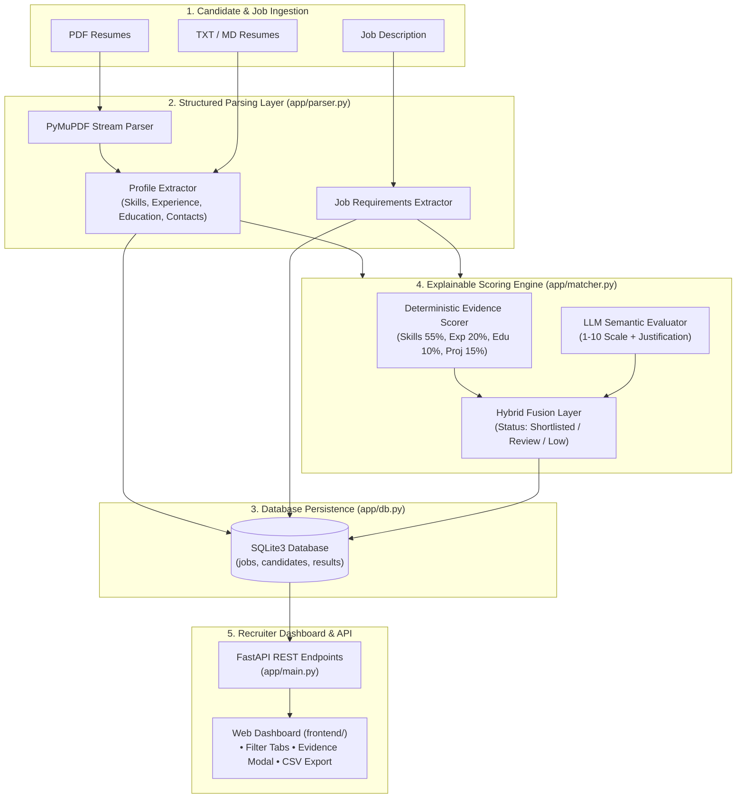

# Smart Resume Screener (EvidenceMatch AI) 🎯

[](https://www.python.org/)
[](https://fastapi.tiangolo.com/)
[](https://www.sqlite.org/)
[](LICENSE)

> An intelligent, explainable AI recruitment screener that parses multi-format resumes (PDF, TXT, MD), extracts structured skills, experience, and education, performs hybrid deterministic and LLM-powered semantic scoring (1–10 scale), and presents actionable candidate shortlists with deep evidence maps.

---

## 📑 Table of Contents

- [Overview & Key Features](#-overview--key-features)
- [System Architecture](#-system-architecture)
- [Hybrid Scoring & Evidence Engine](#-hybrid-scoring--evidence-engine)
- [LLM Prompt Engineering](#-llm-prompt-engineering)
- [Recruiter Dashboard](#-recruiter-dashboard)
- [API Reference](#-api-reference)
- [Project Directory Structure](#-project-directory-structure)
- [Quick Start Guide](#-quick-start-guide)
  - [Prerequisites](#prerequisites)
  - [Installation & Execution](#installation--execution)
  - [Running Automated Tests](#running-automated-tests)
- [2–3 Minute Demo Video Script](#-23-minute-demo-video-script)
- [Evaluation Alignment Matrix](#-evaluation-alignment-matrix)

---

## 🌟 Overview & Key Features

Modern applicant tracking systems (ATS) often rely on naive keyword counts or opaque similarity scores. **Smart Resume Screener** introduces **Explainable Recruitment Intelligence**:

1. **Multi-Format Ingestion**: Ingests resumes in **PDF** (via PyMuPDF), **Plain Text**, and **Markdown** alongside structured job descriptions.
2. **Structured Profile Extraction**: Automatically extracts contact information (Email, Phone, LinkedIn, GitHub), normalized educational qualifications (B.Tech, M.S., Ph.D., MCA, MBA), verified years of experience, and categorized technical skills from an extensible 180+ skill taxonomy.
3. **Dual Matching Architecture**:
   - **Deterministic Scorer**: Evaluates skill evidence depth (`STRONG`, `PARTIAL`, `MISSING`), experience ratio, education match, and project relevance.
   - **LLM Semantic Evaluator**: Executes prompt-engineered zero-hallucination analysis adhering to project brief guidelines (*"Compare the following resume with this job description and rate fit on 1–10 with justification"*).
4. **Shortlist Classification**: Automatically tiers candidates into **Shortlisted** ($\ge 75\%$), **Under Review** ($50\% - 74\%$), and **Not Recommended** ($< 50\%$).
5. **Interactive Recruiter Dashboard**: Modern responsive UI with drag-and-drop multi-file uploading, pre-built job role templates, real-time filtering, rich evidence modal inspection, and 1-click **CSV/JSON export**.
6. **Robust SQLite Persistence**: Relational schema with foreign-key cascade deletes, performance indexes, and automatic schema migration.

---

## 🏗️ System Architecture



---

## ⚖️ Hybrid Scoring & Evidence Engine

The system computes a multi-dimensional fit score:

### 1. Skill Evidence Hierarchy
- **`STRONG` (1.0 weight)**: Skill detected with active contextual verbs (*built, designed, implemented, deployed, architected*) in work experience or projects.
- **`PARTIAL` (0.5 weight)**: Skill is present in candidate's skills list but lacks deep contextual project narrative.
- **`MISSING` (0.0 weight)**: Skill is required by job description but omitted from resume.

### 2. Deterministic Subscore Breakdown
$$\text{Overall Score} = (0.55 \times \text{Skills}) + (0.20 \times \text{Experience}) + (0.10 \times \text{Education}) + (0.15 \times \text{Projects})$$

### 3. Hybrid LLM Fusion (when LLM is enabled)
$$\text{Final Fit} = (0.65 \times \text{Deterministic Score}) + (0.35 \times (\text{LLM Score}_{1\text{--}10} \times 10))$$

*When LLM API keys are not configured, the system gracefully operates in 100% deterministic offline explainability mode.*

---

## 🤖 LLM Prompt Engineering

The system strictly adheres to the prompt guidance specified in the project brief.

### System Prompt
```text
You are an expert AI recruitment screener. Your job is to evaluate candidate fit 
against job descriptions with high objectivity, exact evidence citations, and no hallucinations. 
Do not assume unlisted qualifications. Always respond in valid JSON format only.
```

### User Evaluation Prompt
```text
Compare the following resume with this job description and rate fit on 1–10 with justification.

--- CANDIDATE PROFILE ---
{candidate_json}

--- JOB DESCRIPTION & REQUIREMENTS ---
{job_json}

Return a single JSON object with exact keys:
{
  "score_1_to_10": <number between 1.0 and 10.0>,
  "status": "Shortlisted" | "Under Review" | "Not Recommended",
  "justification": "<2-3 sentence executive reasoning>",
  "evidence": [
    {"skill": "<skill_name>", "level": "STRONG"|"PARTIAL"|"MISSING", "evidence": "<quote or reason>"}
  ],
  "skill_gaps": ["<missing skill 1>", "<missing skill 2>"],
  "strengths": ["<strength 1>", "<strength 2>"]
}
```

---

## 💻 Recruiter Dashboard

The frontend web interface (`frontend/index.html`, `style.css`, `app.js`) provides an end-to-end recruitment cockpit:

1. **Step 1: Role Configuration**: Define customized job postings or select 1-click presets (*Java Backend Engineer*, *Full Stack Developer*, *Data Scientist*).
2. **Step 2: Multi-Resume Upload**: Drag-and-drop multiple PDF, TXT, or MD resumes simultaneously with real-time extraction metrics.
3. **Step 3: Screening & Shortlisting**:
   - Ranked candidate leaderboard with score progress bars.
   - Status categorization tags: `Shortlisted`, `Under Review`, `Not Recommended`.
   - Filter tabs and 1-click **CSV/JSON Report Export**.
4. **Deep Evidence Modal**: Inspect hiring justifications, evaluation subscores, exact quote snippets for every skill, and identified skill gaps.

---

## 📡 API Reference

| Method | Endpoint | Description |
|---|---|---|
| `GET` | `/` | Web Recruiter Dashboard |
| `GET` | `/api/health` | Service health and active LLM configuration status |
| `POST` | `/api/jobs` | Create a job posting & parse requirements |
| `GET` | `/api/jobs` | Retrieve list of all jobs with screening statistics |
| `GET` | `/api/jobs/{id}` | Get specific job details and extracted requirements |
| `DELETE` | `/api/jobs/{id}` | Delete job and cascade-delete screening results |
| `POST` | `/api/candidates` | Upload & parse resume file (`.pdf`, `.txt`, `.md`) |
| `GET` | `/api/candidates` | Retrieve list of all parsed candidates |
| `DELETE` | `/api/candidates/{id}` | Delete candidate profile |
| `POST` | `/api/screen?job_id={id}` | Run screening engine against all candidates for given job |
| `GET` | `/api/results/{job_id}` | Get ranked candidates with optional `?status=` filter |
| `GET` | `/api/results/{job_id}/{cid}` | Retrieve in-depth evidence map and justification for candidate |
| `GET` | `/api/export/{job_id}?format=csv` | Export shortlist report as formatted CSV or JSON |

---

## 📁 Project Directory Structure

```text
smart_resume_screener/
├── app/
│   ├── __init__.py          # Application package initializer
│   ├── config.py            # Environment & app configurations
│   ├── db.py                # SQLite schema, indexes & migrations
│   ├── main.py              # FastAPI REST endpoints & routes
│   ├── matcher.py           # Deterministic & LLM hybrid matching engine
│   └── parser.py            # PDF/TXT parser, taxonomy & extraction
├── frontend/
│   ├── app.js               # Frontend dashboard state & API integration
│   ├── index.html           # Recruiter dashboard UI template
│   └── style.css            # Responsive styles, cards & badge themes
├── sample_data/
│   ├── job.txt              # Sample Java Backend job description
│   ├── resume_1.txt         # Arun Kumar - Senior Backend (Text)
│   ├── resume_2.txt         # Priya Sharma - Fullstack Engineer (Text)
│   ├── resume_1_backend_senior.pdf  # Generated sample Senior Java PDF
│   ├── resume_2_fullstack_mid.pdf   # Generated sample Fullstack PDF
│   └── resume_3_data_scientist.pdf  # Generated sample Data Scientist PDF
├── tests/
│   ├── __init__.py          # Test suite package
│   ├── test_api.py          # FastAPI endpoint integration tests
│   ├── test_matcher.py      # Matcher algorithm & evidence unit tests
│   └── test_parser.py       # Parser & structured extraction unit tests
├── .env.example             # Environment configuration template
├── .gitignore               # Clean Git ignore rules
├── requirements.txt         # Project dependencies
├── run.bat                  # 1-Click execution script for Windows
├── run.sh                   # 1-Click execution script for Linux/macOS
└── README.md                # Complete project documentation
```

---

## 🚀 Quick Start Guide

### Prerequisites
- Python 3.10 or higher installed on your system.

### Installation & Execution

1. **Clone the repository:**
   ```bash
   git clone <YOUR_GITHUB_REPO_URL>
   cd smart_resume_screener
   ```

2. **Create & activate virtual environment:**
   ```bash
   # Windows:
   python -m venv .venv
   .venv\Scripts\activate

   # Linux / macOS:
   python3 -m venv .venv
   source .venv/bin/activate
   ```

3. **Install dependencies:**
   ```bash
   pip install -r requirements.txt
   ```

4. **(Optional) Configure LLM:**
   Copy `.env.example` to `.env` and set your OpenAI/Groq/Ollama API credentials:
   ```bash
   cp .env.example .env
   ```

5. **Start the application:**
   ```bash
   python -m uvicorn app.main:app --reload --port 8000
   ```
   Or run using the convenience scripts:
   - Windows: `run.bat`
   - Linux/macOS: `./run.sh`

6. **Open Dashboard:**
   Navigate to [http://127.0.0.1:8000](http://127.0.0.1:8000) in your browser.

---

### Running Automated Tests

Execute the comprehensive 19-test suite with `pytest`:
```bash
python -m pytest tests/ -v
```

---

## 🎥 2–3 Minute Demo Video Script

Use this timestamped walkthrough outline to record your demo video:

| Timestamp | Section | Narration & Visual Actions |
|---|---|---|
| **0:00 – 0:30** | **Introduction & Overview** | • Welcome viewer and state the goal: *Smart Resume Screener — an explainable AI system that parses resumes, extracts structured data, and ranks candidates against job descriptions using hybrid evaluation.*<br>• Show the running web dashboard and the architecture overview in README. |
| **0:30 – 1:00** | **Job Creation & Parsing** | • Click on the **"Java Backend"** quick template (or paste a custom JD).<br>• Click **"Create Job Posting"**.<br>• Highlight how the system automatically extracted required skills (`Java`, `Spring Boot`, `SQL`, `Docker`, `Git`, `AWS`) and experience requirements into SQLite. |
| **1:00 – 1:45** | **Multi-Resume Upload & Screening** | • Drag and drop sample resumes from `sample_data/` (including `resume_1_backend_senior.pdf` and `resume_2_fullstack_mid.pdf`).<br>• Click **"Parse & Save Resumes"** and note the instant skill count feedback.<br>• Click **"Screen Candidates"**.<br>• Observe the ranked candidate leaderboard with calculated scores, 1–10 ratings, and status tags (`Shortlisted`, `Under Review`). |
| **1:45 – 2:30** | **Inspect Evidence & Explainability** | • Click **"Inspect Evidence"** on the #1 ranked candidate (Arun Kumar).<br>• Show the **Executive Justification**, subscores (Skills, Experience, Education, Projects), and the **Evidence Map** highlighting `STRONG` evidence citations.<br>• Inspect the lower-ranked candidate to demonstrate detected **Skill Gaps**.<br>• Click **"Export CSV"** to demonstrate recruiter reporting. |
| **2:30 – 3:00** | **Codebase, Tests & Conclusion** | • Switch to terminal and run `pytest tests/ -v` showing all 19 tests passing.<br>• Mention modular architecture (`parser.py`, `matcher.py`, `db.py`, `main.py`).<br>• Conclude video. |

---

## 📊 Evaluation Alignment Matrix

| Evaluation Criteria | Implementation Detail | Status |
|---|---|---|
| **Input Support** | Supports PDF (via PyMuPDF stream parser), TXT, and MD resumes. Sample PDFs included in `sample_data/`. | ✅ Complete |
| **Data Extraction** | Multi-domain 180+ skill taxonomy, experience year calculation, normalized degrees, contact details. | ✅ Complete |
| **LLM Semantic Scoring** | Prompt adheres to specification (*"Compare the following resume with this job description and rate fit on 1–10 with justification"*). Structured JSON output with fallback. | ✅ Complete |
| **Shortlist & Justification** | Categorizes candidates into Shortlisted / Review / Not Recommended with executive summary & subscores. | ✅ Complete |
| **Backend & Database** | FastAPI REST API + SQLite schema with cascade deletion, indexes, and schema auto-migration. | ✅ Complete |
| **Frontend Dashboard** | Recruiter web app with drag-and-drop upload, filter tabs, evidence modal, and CSV/JSON export. | ✅ Complete |
| **Code Quality & Testing** | Modular typed Python code, clean exception handling, and 19 automated unit & integration tests. | ✅ Complete |
| **Deliverables** | Git repository with milestone commits, comprehensive README, and video demo script. | ✅ Complete |

---

## 📄 License
This project is licensed under the MIT License.
